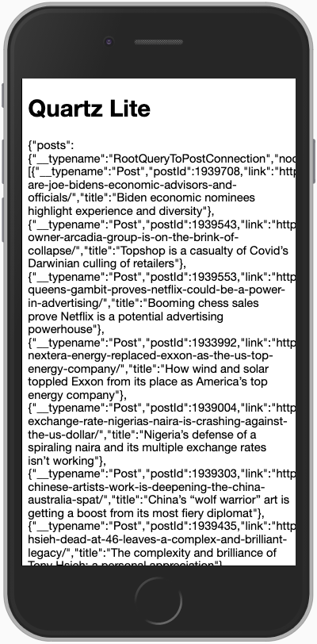

# Quartz Lite starter pack

Boilerplate for creating your very own text-only Quartz reader. Fetches the latest articles from Quartz’s [GraphQL endpoint](http://query.quartz.work/).

## Local development

### Requirements

- [Node.js and npm](https://docs.npmjs.com/downloading-and-installing-node-js-and-npm)
- [npx](https://www.npmjs.com/package/npx) package runner (included in npm >v5.2.0)

### Instructions

1. Run `npm i` to install dependencies
2. Spin up a local development server with `npm start` (this may take some time). Once the server has started, navigate to [http://localhost:3000](http://localhost:3000), where you should see a webpage that looks like this:

